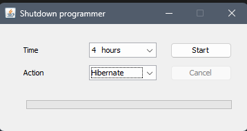

# shutdown-programmer
Shutdown application. GUI to shutdown, suspend or hibernate your pc after a programmed time

## Usage

Download the last version and execute double click on the jar file.
The software requires to download any Java 11 or upper Runtime.

# Donate
Buy me a coffe to help me continue supporting this project. 
<a href="https://www.paypal.com/donate/?hosted_button_id=K6DQ5GLE8KHGY">Buy me a coffe</a>

# Security
You could check any important security information at the [security document](SECURITY.md)
